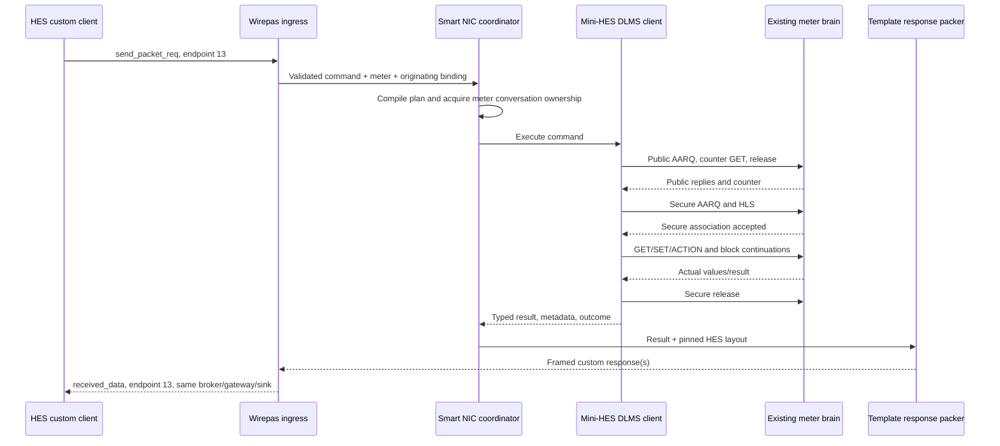

# Custom pull commands: Wirepas Smart NIC and mini-HES implementation plan

Date: 2026-09-10. Status: source investigation complete; implementation has not started.

The deliverable is a Wirepas NIC that accepts a custom command from HES on endpoint 13, decodes its intent, runs the public and secure DLMS conversation against the existing meter brain, and returns the resulting data in the custom binary format HES parses. The NIC contains the mini-HES **client**; `DLMSServerSession` remains the meter **server**. These are separate responsibilities even though both run inside the simulator process.

This document records verified source contracts, proposed design, implementation order, and unresolved interoperability requirements. The executable checklist is in [task list.md](<C:/Users/ayush/OneDrive/Documents/Development/Sinhal Repos/Meter-Simulator/ManyMeterSimulator/task list.md>). Only these two planning documents are added by this task. No simulator/HES code, database, package, deployment, or existing staged document is changed.

## 1. Outcome and boundaries

For a supported command, template, category, and selection:

1. HES publishes its existing Wirepas `GenericMessage.wirepas.send_packet_req`.
2. The simulator identifies endpoint 13, resolves the target meter and its HES template, and validates the custom request.
3. The NIC converts the wire command into an explicit DLMS execution plan.
4. A mini-HES client completes the seven logical DLMS steps through `IMeterSimBridge.ExchangeAsync`.
5. The NIC maps **returned DLMS values** to the response template, applies the inverse HES encoding, frames the result, and publishes a Wirepas received-data event to endpoint 13 on the originating broker.
6. HES correlates the response to its command and decodes the expected rows, timestamps, values, and status.

The first vertical slice is a block-load read. The completed read-command scope includes instantaneous, block, daily, billing, nameplate, clock, event, and supported scalar/status reads. HES also calls meter SET/ACTION operations “pull commands”; these receive a later, explicit implementation phase using the same authenticated runner. Firmware transfer, NIC configuration, diagnostic/stored-IP endpoints, and separate RTC-sync endpoints are separate protocols, outside this implementation.

Endpoint 3 continues to transport ordinary DLMS. A meter remains `MqttWirepas`; do not introduce a second RF2 meter/NIC identity. The mini-HES uses the simulator's WRAPPER bridge. HDLC support would require a different bridge contract and is not necessary to communicate with the current brain.

### Required invariants

- Every meter reading and mutation travels through real DLMS requests to the same authoritative brain used by normal pulls. No direct `_meter` value lookup, template-buffer shortcut, or invented response values in the NIC.
- Historical profile rows come from the selected profile buffer/range. Reading today's scalar OBIS values cannot substitute for historical rows.
- Missing mappings, unavailable objects, numeric overflow, or unsupported response layouts cannot become zero-filled “success” payloads.
- Preserve meter identity, request correlation, originating broker/gateway/sink, and template version throughout the operation.
- Meter values and association/security state are distinct. Releasing an association must not recreate the meter or erase prior writes.
- Honor existing admission, bad-communication, batch lifecycle, and delay rules. Preserve compatibility with the separately planned powered-off and shared-snapshot behavior; that behavior model is not a prerequisite implementation claim.
- Allocate clients and buffers for bounded active work, not one permanent mini-HES/timer per provisioned meter.

## 2. Investigated source snapshot

All evidence below is from local working copies. No remote fetch, live HES configuration read, database execution, service restart, build, or test run was performed for this plan.

| Repository | Checked-out branch | Local HEAD | Observations |
|---|---|---|---|
| Meter-Simulator | `Custom-Push-Implementation` | `bafba07fc7dda8a083323560e15826a8c6e7114f` | Repository root is the parent of this document's folder. Three pre-existing behavior/math documents are staged. |
| vayu-core | `feature/1101-custom-pull-serialization` | `aeae49807518f621902a4a506a20d4dc239fd2dc` | Clean at inspection; authoritative request/response orchestration reference. |
| vayu-common | `master-pg` | `d43802cb37b4c55bd3e6e19efdbeadc95d6b03fe` | Clean; exact local tag `v3.9.67-rc.21`; contains request serializer and generic parser. |
| vayu-sql-database | `master-pg-convert` | `54161f5c9dcf62facfa01ee62ae8fc5efe4f534c` | Clean; exact local tag `v4.6.250-rc.27`; supplied SQL metadata and enums. |

Core's MQTT project and existing `project.assets.json` both resolve Common `3.9.67-rc.21`, Database `4.6.250-rc.27`, Gurux.DLMS `9.0.2508.2201`, and Kimbal.Gurux `1.1.0`. Both CrystalHES packages' local `.nupkg.metadata` point to the Kimbal GitHub Enterprise NuGet feed. This establishes the local reference graph, not the DLLs deployed in HES.

The simulator and `MeterSimulator.Core` target `net10.0`. The brain references the in-repository Gurux projects. Reuse that library for runtime execution; use the HES-resolved packages as interoperability references/test oracles without adding the production MQTT service and its database dependencies to the NIC.

### Evidence index

Line numbers refer to the snapshot above. Recheck them after source changes.

| ID | Source and role |
|---|---|
| S01 | [MQTTSendCustomCommandClient.ProcessCommand](<C:/Users/ayush/OneDrive/Documents/Development/Sinhal Repos/vayu-core/CrystalHES.MQTTService/Client/MQTTSendCustomCommandClient.cs:134>): request creation, selectors, values, CRC, endpoints, and command aliases. |
| S02 | [Custom client response path](<C:/Users/ayush/OneDrive/Documents/Development/Sinhal Repos/vayu-core/CrystalHES.MQTTService/Client/MQTTSendCustomCommandClient.cs:1438>): reassembly, frame correlation, generic parser selection, command-specific responses. |
| S03 | [MQTTSendCommandClient](<C:/Users/ayush/OneDrive/Documents/Development/Sinhal Repos/vayu-core/CrystalHES.MQTTService/Client/MQTTSendCommandClient.cs:195>): public/secure client setup and seven-step state machine. |
| S04 | [CustomPullCommandPayload](<C:/Users/ayush/OneDrive/Documents/Development/Sinhal Repos/vayu-common/CrystalHES.Common/Helpers/CustomPullCommandPayload.cs:16>): physical serialization and selector enum. |
| S05 | [Common Functions](<C:/Users/ayush/OneDrive/Documents/Development/Sinhal Repos/vayu-common/CrystalHES.Common/Helpers/Functions.cs:261>): response profile byte enum; Wirepas builder at 1277; command OBIS lookup at 1306; byte sizes at 1928. |
| S06 | [GenericHelpers](<C:/Users/ayush/OneDrive/Documents/Development/Sinhal Repos/vayu-common/CrystalHES.Common/Helpers/GenericHelpers.cs:98>): template lookup key, index rules, and `DLMSRequestHelper`. |
| S07 | [CustomGenericParser](<C:/Users/ayush/OneDrive/Documents/Development/Sinhal Repos/vayu-common/CrystalHES.Common/CustomGenericParser.cs:29>): `GenericParser.ParseCustom`, profile headers, and profile-specific decoding. |
| S08 | [NonDLMSDataParser](<C:/Users/ayush/OneDrive/Documents/Development/Sinhal Repos/vayu-common/CrystalHES.Common/Helpers/NonDLMSDataParser.cs:347>): time conversion, scalar application, integer/float decoding. |
| S09 | [DLMSHandlingFunctions](<C:/Users/ayush/OneDrive/Documents/Development/Sinhal Repos/vayu-common/CrystalHES.Common/Helpers/DLMSHandlingFunctions.cs:670>): old/new custom response header removal and fragmentation. |
| S10 | [Generic template initialization](<C:/Users/ayush/OneDrive/Documents/Development/Sinhal Repos/vayu-core/CrystalHES.MQTTService/CrystalHESMQTTService.cs:233>): grouping and cumulative byte offsets. |
| S11 | [CommandTypeEnum](<C:/Users/ayush/OneDrive/Documents/Development/Sinhal Repos/vayu-sql-database/CrystalHES.Database/Enums/CommandTypeEnum.cs:5>) and [template DTOs](<C:/Users/ayush/OneDrive/Documents/Development/Sinhal Repos/vayu-sql-database/CrystalHES.Database/DTOs/MeterTemplate.cs:21>): IDs, metadata, and `NewHeader` predicate. |
| S12 | [MeterTemplate.sql](<C:/Users/ayush/OneDrive/Documents/Development/Sinhal Repos/vayu-sql-database/db_automation/Template-DM/MeterTemplate.sql:1>), [MeterTemplateDetail.sql](<C:/Users/ayush/OneDrive/Documents/Development/Sinhal Repos/vayu-sql-database/db_automation/Template-DM/MeterTemplateDetail.sql:1>), [MagicNumberMapping.sql](<C:/Users/ayush/OneDrive/Documents/Development/Sinhal Repos/vayu-sql-database/db_automation/Template-DM/MagicNumberMapping.sql:1>). |
| S13 | [ObisCodeMapping.sql](<C:/Users/ayush/OneDrive/Documents/Development/Sinhal Repos/vayu-sql-database/db_automation/DM/ObisCodeMapping.sql:1>): field-to-OBIS/attribute/unit/scalar mappings and incremental updates. |
| S14 | [WirepasCodec](<C:/Users/ayush/OneDrive/Documents/Development/Sinhal Repos/Meter-Simulator/ManyMeterSimulator/ManyMeterSimulator/Networking/Mqtt/Codecs/WirepasCodec.cs:74>) and [MQTT listener](<C:/Users/ayush/OneDrive/Documents/Development/Sinhal Repos/Meter-Simulator/ManyMeterSimulator/ManyMeterSimulator/Networking/Mqtt/MqttNicListenerService.cs:454>): present routing and one-frame execution. |
| S15 | [Rf2Framing](<C:/Users/ayush/OneDrive/Documents/Development/Sinhal Repos/Meter-Simulator/ManyMeterSimulator/ManyMeterSimulator/Networking/Mqtt/Codecs/Rf2Framing.cs:12>), [HesDataModel](<C:/Users/ayush/OneDrive/Documents/Development/Sinhal Repos/Meter-Simulator/ManyMeterSimulator/ManyMeterSimulator/Networking/SmartNic/HesDataModel.cs:22>), [CommandIntent](<C:/Users/ayush/OneDrive/Documents/Development/Sinhal Repos/Meter-Simulator/ManyMeterSimulator/ManyMeterSimulator/Networking/SmartNic/CommandIntent.cs:14>). |
| S16 | [Brain bridge](<C:/Users/ayush/OneDrive/Documents/Development/Sinhal Repos/Meter-Simulator/ManyMeterSimulator/ManyMeterSimulator/Brain/BrainMeterSimBridge.cs:24>), [MeterSessionManager](<C:/Users/ayush/OneDrive/Documents/Development/Sinhal Repos/Meter-Simulator/ManyMeterSimulator/ManyMeterSimulator/Brain/MeterSessionManager.cs:12>), [DLMSServerSession](<C:/Users/ayush/OneDrive/Documents/Development/Sinhal Repos/Meter-Simulator/MeterSimulator.Core/DLMS/DLMSServerSession.cs:788>). |
| S17 | [NodeDispatcher](<C:/Users/ayush/OneDrive/Documents/Development/Sinhal Repos/Meter-Simulator/ManyMeterSimulator/ManyMeterSimulator/Networking/Mqtt/NodeDispatcher.cs:20>) and [MeterIdentity](<C:/Users/ayush/OneDrive/Documents/Development/Sinhal Repos/Meter-Simulator/MeterSimulator.Core/Models/MeterIdentity.cs:28>): concurrency and shared simulator identity. |
| S18 | [CustomPushFramer](<C:/Users/ayush/OneDrive/Documents/Development/Sinhal Repos/Meter-Simulator/ManyMeterSimulator/ManyMeterSimulator/Networking/CustomPush/CustomPushFramer.cs:11>) and [Template93](<C:/Users/ayush/OneDrive/Documents/Development/Sinhal Repos/Meter-Simulator/ManyMeterSimulator/ManyMeterSimulator/Networking/CustomPush/Template93.cs:10>): reusable framing versus push-specific synthetic body. |

## 3. Existing groundwork and verified gaps

| Existing component | Reuse | Required change or limitation |
|---|---|---|
| `WirepasCodec` | Protobuf envelope handling, node routing, gateway/sink extraction | `TryRoute` currently rejects every destination endpoint except 3. Add demultiplexing without changing meter identity. |
| `Rf2Framing` | Basic field positions, LE reads, CRC implementation | Ignores declared length and `DataLength`; lacks request CRC validation and width validation; values are unsigned only. Its legacy builder emits five bytes, whereas custom pull templates typically require ten. |
| `CommandIntent` | Transport-independent command/result seam | Local enum ordinals are not HES IDs; missing latest-entry and date-write selectors. Preserve raw bits and typed intent separately. |
| `MeterReadRow` | Result carrier | OBIS-only dictionary can collide across attributes/capture columns. Replace with explicit object/capture binding identity. |
| `HesDataModel` / loader | CSV reading, sorted fields, profile-template indirection | Not registered/used in the runtime path. Missing profile-header template, event-nonprofile ID, full HES key, and ObisCodeMapping input. Reverse magic lookup currently chooses the first mapping. |
| Batch `HesTemplateId` | Existing optional setup/persistence field | Add explicit custom capability/configuration; XML model and HES template remain separate selections. |
| `NicDecodeResult` | Ordinary DLMS result contract | DLMS-only byte payload and `ushort` frame ID cannot represent a custom operation with a 32-bit correlation. |
| `MqttNicListenerService` | Admission, capture, originating `BoundBrokerClient`, response publish | Present path assumes one decoded WPDU causes one bridge call. Introduce a command execution branch. |
| `NodeDispatcher` | Per-meter FIFO and bounded mailbox | Global semaphore spans an entire work item. Custom work becomes a long conversation; add separate conversation and per-exchange limits. |
| `BrainMeterSimBridge` | Correct full-WPDU funnel | `lock(session)` protects one call, not ownership across a multi-call association. |
| `MeterSessionManager` | Same authoritative session per meter index | Sessions currently persist in RAM until reset. Do not claim fleet paging/eviction is already implemented. |
| Custom push implementation | Old 10-byte/new 12-byte header shapes | `Template93.BuildDaily1P` manufactures values and emits scheduled-push fields. It is unsuitable as a custom-pull body or source of readings. |

The old `smart_nic_handoff.md` is useful background, but its runtime counts and deferred-work statements are historical. In particular, its expected `KimbalSpecifics/DataModel` CSV directory is absent in the current working copy. Its “everything except CRC is LE” statement applies to the custom binary fields, not DLMS/WRAPPER internals or special command payloads.

## 4. Request protocol: reverse of SendCustomCommand

### 4.1 Wirepas envelope and endpoint selection

- Inbound MQTT topic: `gw-request/send_data/{gatewayId}/{sinkId}`.
- Protobuf member: `GenericMessage.wirepas.send_packet_req`.
- Meter address: `destination_address`; packet intent: `destination_endpoint`.
- Custom meter command channel: source/destination endpoint 13 in the inspected sender.
- Transparent DLMS: endpoint 3. Diagnostics/stored-IP: 14; NIC config: 24; SyncRTCV2 SET stage: 30; selected FOTA: 31; additional response handlers exist for 120 and ping-related endpoints.
- `req_id` is Wirepas transport correlation. The inner custom `FrameId` is HES command correlation. Preserve both; they are not interchangeable.
- Resolve the correct broker binding and batch before choosing widths. Validate outer destination and inner node IDs agree with the resolved meter. Reject unsupported broadcast/routing forms until a source-backed contract exists.

### 4.2 Inner packet layout

Let `F` be frame-ID bytes and `N` node-ID bytes. The current serializer writes both trailing Int32 values even when their semantic `DataLength` is zero or four.

| Offset | Width | Field | Interpretation |
|---|---:|---|---|
| 0 | 1 | PacketLength | Physical serialized length, including appended request CRC where applicable. |
| 1 | 1 | TotalFragments | Sender sets 1 for this request builder. |
| 2 | 1 | FragmentId | Sender sets 1. |
| 3 | F | FrameId | LE; 2 old / 4 new. |
| 3 + F | N | FromNodeId | LE; sender copies target node into this field. |
| 3 + F + N | N | ToNodeId | LE; same target in the inspected builder. |
| 3 + F + 2N | 1 | CommandType | Explicit HES wire command byte after alias rewriting. |
| 4 + F + 2N | 1 | DataSelector | HES selector byte, not the current simulator enum ordinal. |
| 5 + F + 2N | 1 | DataLength | Semantic value size: usually 0, 4, or 8. |
| 6 + F + 2N | 4 | CommandValueFrom | Int32 bits, LE; interpretation is command/selector-specific. |
| 10 + F + 2N | 4 | CommandValueTo | Int32 bits, LE; still serialized when unused. |
| 14 + F + 2N | 2 if required | CRC | CCITT-FALSE, big-endian trailer over the preceding packet bytes. |

Physical lengths are 22 bytes for F=2/N=3, 24 for F=2/N=4, and 26 before CRC for F=4/N=4. A normal new-header endpoint-13 request is therefore 28 bytes. It does **not** begin with the response's four-byte magic number or twelve-byte response header.

Generic HES mode derives `NewHeader` from **both** push and pull header lengths being 12; frame width is 4 if new, otherwise 2. Node width is 4 when new or `IsFG23`, otherwise 3. The non-generic path uses a different template-ID-specific FG23 rule. The simulator's current `PullHeaderLength == 12 || IsFG23` shortcut is not an exact implementation of all HES modes. Compile a protocol profile matching the selected HES mode; never guess widths from packet contents.

### 4.3 Selector values and typed intent

| Wire value | HES name | Semantic length | Proposed representation |
|---:|---|---:|---|
| 1 | GetWithoutData | 0 | Plain/default read, retaining command-specific default selection. |
| 2 | SetWithData | 4 | Raw value bits plus declared command value type. |
| 3 | SetWithDate | 4 | Command-specific date/time. |
| 4 | GetWithEntryRange | 8 | Explicit entry-selection contract. |
| 5 | GetWithDateRange | 8 | Date range, except commands such as gap-reading bitmaps. |
| 6 | GetLatestEntriesRange | 8 | Latest-entry selection requiring profile count/order semantics. |

Use an explicit mapping/switch; do not cast into the current `CustomDataSelector` enum (`Get=0`, etc.). Preserve `RawCommandType`, `RawSelector`, declared length, and both 32-bit words alongside the interpreted values for diagnostics and lossless replay. Command value type can be signed integer, unsigned bits/bitmap, IEEE754 Float32 bits, epoch, or entry bounds. The wire serializer's `int` fields do not mean every command is an integer operation.

### 4.4 Semantics that need explicit rules

- `GetBlockLoadProfileInternal` (72) is rewritten to block command 4. It cannot be recovered as 72 from this packet; decode the actual command 4 and its selection.
- `GetDIEventProfile` (90) is sent as `GetDIData` (83). Other aliases reuse numbers for firmware operations; resolve by endpoint/protocol context.
- Block date ranges commonly have 330 minutes added by HES before epoch serialization. Capital and other conditional branches differ; generic date-range branches for other commands use the supplied dates without that addition. `GetUnixTime` subtracts the epoch from the supplied DateTime; its local-time temporary is unused. Do not apply one universal input offset.
- Gap block reading (21) puts the start time in `From` and a 32-bit gap bitmap in `To`; the latter is not an end timestamp.
- HES can collapse an empty/zero selection to GetWithoutData or satisfy a request internally without emitting a packet. The simulator handles received bytes, not HES queue/cache orchestration.
- Load/current limit SET values can be float bit patterns. Preserve sign and reinterpret the bits before DLMS conversion.
- Standard inspected packets fit well below the historic 90-byte RF chunk size. Do not reuse the endpoint-3 trailer reassembler for custom requests. Fragmented custom input requires a separate verified contract; report unsupported until implemented, with bounded buffering once supported.

## 5. Command-to-DLMS and response catalogue

The catalogue is keyed by endpoint + wire command + selector + protocol profile, and supplies the operation, object binding, selection policy, response family, and supported template/category combinations. Generic field layouts alone do not define command execution or status replies.

| HES command / wire ID | DLMS reference operation | Response family and delivery phase |
|---|---|---|
| GetInstantProfile / 3 | ProfileGeneric `1.0.94.91.0.255`, buffer attribute 2 | Generic instantaneous custom-pull layout; first read expansion. |
| GetBlockLoadProfile / 4 (also source 72) | ProfileGeneric `1.0.99.1.0.255`, buffer 2; range/entry/default selection | Generic block layout; first vertical slice. |
| GetDailyLoadProfile / 5 | ProfileGeneric `1.0.99.2.0.255`, buffer 2 | Generic daily layout; verify per-message row behavior. |
| GetBillingProfile / 6 | ProfileGeneric `1.0.98.1.0.255`; entries-in-use 7 then buffer 2 | Generic billing layout; HES reference has billing-specific entry arithmetic. |
| GRBlockLoadProfile / 21 | Block profile plus bitmap-driven selection | Read expansion after bitmap and row-order fixtures. |
| GetNamePlate / 24 | ProfileGeneric `0.0.94.91.10.255`, buffer 2 in `DLMSRequestHelper` | Command-specific typed/length-prefixed response; not an instantaneous template alias. |
| GetSingleActionSchedule / 25; GetRTC / 48 | Read the actual schedule/clock attribute; clock is class 8, `0.0.1.0.0.255`, attribute 2 | `ParseProfileData` prefix and command-specific result; generic clock path also exists and must match enabled HES routing. |
| GetDemandIntegrationPeriod / 26; relay / 27; load limit / 28; profile period / 29; instant period / 36; current limit / 39 | Explicit object class and attribute from HES helper, verified against the meter XML/capture descriptors | Scalar result encoders; widths, units, and conversions differ. |
| Nonprofile events / 30-35 | HES command-specific OBIS/class/attribute | Separate from profile-event buffer reads. Preserve event semantics. |
| Profile events / 41-47; DI source 90 → wire 83 | ProfileGeneric; read entry count then selected buffer; event family-specific object | Generic event/nonprofile layouts and event ID mapping. DI is a distinct command alias. |
| Net metering / 51; payment mode / 53; ESWF / 66; prepaid parameters / 70 | Explicit read plans from HES helper | Command-specific result structures; implement after primary profiles. |
| Meter SET/ACTION commands listed in `SupportedPullCommands` | Authenticated `Write`/`Method` with per-command types and attributes | Later phase: actual brain mutation, custom status, and ordinary-DLMS readback. |

The OBIS values above are the inspected default mappings, not universal manufacturer assumptions. Compile against the chosen XML and the corresponding HES metadata. Resolve object class, attribute, data index, and profile context. Do not silently replace an absent profile/object with a similarly named one.

Phase 0 must reconcile every entry of Core's `SupportedPullCommands` with `GetCustomCommandDataSelector`, command rewriting, `DLMSRequestHelper`, and the response branch. Being in a supported array is not proof that the sender can serialize it; for example GetSingleActionSchedule appears in the supported list but needs a sender-selector check. Record such inconsistencies as HES findings rather than inventing bytes.

## 6. Seven-step mini-HES runner

Model this as seven **logical** steps, not a fixed seven request/response packets. Association messages, capture metadata, block continuation, and cleanup can each require additional exchanges.

| Step | Mini-HES action | Success condition and source |
|---:|---|---|
| 1 | Create public client, client address `0x10`, server address 1, LN referencing, Authentication.None, WRAPPER. Generate AARQ and pass complete WPDU(s) through the bridge. | Decode reply with `GetData`; accept and parse AARE. S03 around 559 and 1065. |
| 2 | Public GET of class Data `0.0.43.1.3.255`, attribute 2. | Read invocation counter from actual server reply. Brain currently projects its live counter here. S03 around 1122; S16 around 804. |
| 3 | Release public association and consume the release response. | Transition only after expected response, or a documented recovery outcome. S03 around 3682. |
| 4 | Create secure client at `0x30` with Authentication.High, correct simulator HLS material, system-title policy, and AuthenticationEncryption. Seed invocation counter according to the verified library/server exchange. Send secure AARQ. | Parse accepting secure AARE; validate authentication/security settings. S03 around 195 and 3737. |
| 5 | Generate `GetApplicationAssociationRequest()` and consume its method reply. | `ParseApplicationAssociationResponse` validates the HLS exchange. S03 around 1025 and 3787. |
| 6 | Execute the compiled GET/SET/ACTION plan. Read capture descriptors/scaler-unit/entry metadata where required, then the selected data. | Accumulate every valid DLMS block via `GetData`, `IsMoreData`/`ReceiverReady`; validate reply errors, shapes, and counts. S03 around 879 and 3791; S06 `DLMSRequestHelper`. |
| 7 | Release secure association and clean up client/buffer resources. | Release attempted in `finally`; preserve meter values and counters. Record primary command error separately from cleanup failure. S03 final response/release handlers. |

HES assigns the counter read at step 2 before the secure request; do not add or subtract a value merely from generic DLMS advice. Tests must determine the installed Gurux client's increment behavior and the server's accepted sequence. Verify monotonicity across consecutive custom commands, ordinary pulls, failures, and process/batch lifecycle rules. The inspected secure client sets receive/PDU limits to 70 and enables GeneralBlockTransfer; reproduce this constrained setting in interoperability tests and verify negotiation with the simulator's Gurux version. DLMS PDU limits and RF packet sizes are separate controls.

HES uses one `GlobalKey` for both cipher and authentication keys in the inspected setup. The simulator's `MeterIdentity` provides distinct cipher/authentication/HLS material. The mini-HES must obtain the **simulated meter's actual security configuration**, including any supported changes, from a narrow provider shared with the brain. Copying HES's database-key assumption would fail against the simulator. Key values must not appear in logs or fixtures.

Expose a small `ExchangeAndDecodeAsync` loop with cancellation, total operation deadline, per-exchange deadline, maximum continuation count, maximum rows/bytes, and expected command validation. Clear reply buffers only after retaining the values needed by the next state. Check returned byte length before calling the DLMS parser. Empty bridge replies are transport/no-response outcomes, not successful empty profile reads.

Profile results retain raw values, DLMS type, capture column identity, scaler/unit provenance, and timestamp context. Convert values once during response projection. Preserve a profile's historical capture order and duplicate OBIS occurrences by keying bindings with `(profile LN, class ID, object LN, attribute, data index, capture ordinal)` rather than OBIS alone.

## 7. Metadata and generic response compilation

### 7.1 Inputs and loading

Use an immutable, versioned local HES metadata bundle. Its source manifest records the HES version, SQL/export origin, file hashes, and chosen template/magic. Loading occurs at startup; refresh replaces the bundle and restarts. No HES database connection is required during a custom command.

The provided SQL files are source evidence and seed/update scripts. They include `USE`, `TRUNCATE`, conditional INSERTs, and UPDATEs; **do not execute them** to obtain simulator configuration. Build an offline importer for their supported data statements or use an authoritative export of their resulting tables. The importer must handle SQL quoting, NULL, Unicode literals, and update ordering. Ambiguous/incomplete incremental state must remain a diagnostic, not a fabricated base row.

Retain the existing CSV loader where useful, but extend the bundle with `ObisCodeMapping`. Existing `ProfileAttributeMapping` is an optional explicitly identified additional source when available; its absent CSV cannot be a hidden runtime dependency. The supplied `LHES-929_dbo.ProfileAttributeMapping.sql` only adds a column and does not provide the old exported data.

### 7.2 Exact lookup chain

1. Batch `HesTemplateId` identifies the HES meter-template mapping. Preserve both `Id` and `MeterTemplateId` because HES's generic lookup uses `MeterTemplateId`.
2. Template selects pull/push header lengths, payload types, `IsFG23`, `MeterProfileHeaderTemplateId`, and Block/Daily/Bill/Instant/Event/EventNonProfile/Misc profile-template IDs.
3. Select the profile-template ID for the command. **A profile-template ID is not a meter-template ID.**
4. Match HES's composite layout key `(CommandTypeId, normalized category, PayloadType, TypeId, ProfileTemplateId)`. Generic custom pulls use payload type 2 and OnDemand type 2. Category mapping is D1→1P, D2→3P, D3→CT. Preserve `ProfileType` as a descriptive discriminator and cross-check for the enabled layout, not as the only key.
5. Sort fields by `SerialNumber`; calculate `StartIndex` as cumulative physical widths, as `RefreshGenericTemplateDetails` does. Retain parameter name, scalar, type, profile, and `Details`.
6. Join each field to an explicitly mapped OBIS/attribute and the XML/capture descriptor. `ObisCodeMapping.FieldName` uses DTO names such as `singlephase.BlockLoadProfile.NeutralCurrent`. Category/profile/name aliases need a documented table; text similarity is insufficient.
7. If a ProfileAttributeMapping export is used, retain its `(ProfileType, Category, Attribute)` key and `AttributeIndex` provenance. Conflicts with ObisCodeMapping or capture descriptors produce an enabled-layout diagnostic; do not introduce silent precedence/fallback.
8. Compile immutable read/projection/byte-layout plans keyed by metadata hash + XML fingerprint + command/category/protocol profile. A new XML batch must not accidentally share incompatible capture bindings.

Missing attribute IDs in the SQL are real: several rows explicitly contain NULL. The provided file also lacks some core sample fields, including the searched three-phase block RPhaseCurrent/BPhaseVoltage entries. A layout is usable only after all required fields resolve from the identified authoritative sources and actual XML. Do not infer attribute 2 for every null entry.

Magic mapping is one-to-many in reverse: template 34 has two entries and template 93 has five in this SQL snapshot. Preserve the set. Pin an explicit valid response magic in the protocol profile when there are multiple choices; reject a mismatched configured magic. The loader's current “first mapping wins” policy is not a verified firmware selection rule. Do not globally reject unrelated historical mappings.

### 7.3 Response construction: three layers

```text
Wirepas packet_received_event
  payload = NIC response header (10 or 12 bytes, per fragment)
          + custom meter-profile header (normally 12 or 11 bytes, once per complete body)
          + command-specific body or template-ordered profile rows
```

**Layer A: NIC header.**

| Generation | Header bytes |
|---|---|
| Old custom | length:u8, totalFragments:u8, fragmentIndex:u8, frameId:u16 LE, opaque bytes[5]. HES strips all 10 bytes. The inspected reassembler only interprets the first five. |
| New custom | magic:u32 LE, packetLength:u16 LE, totalFragments:u8, fragmentIndex:u8, frameId:u32 LE. HES strips 12 bytes. |

Use checked length/range arithmetic. The existing push framer's unchecked legacy length cast is not acceptable as proof of a valid large pull response. Response CRC must be determined independently: S01 explicitly adds **request** CRC, while the inspected S09 response reassembly removes the header and does not strip or validate a response CRC. The baseline response body has no invented trailer; fixtures/captures must establish any firmware-specific exception.

**Layer B: meter-profile header.** Reverse `GenericParser.ParseHeader` (S07):

| Header template | Body-relative layout |
|---|---|
| 3 | profileType:u8 at 0; `(clockStatus << 4) | rowCount` at 1; meterAlpha:u16 LE at 2; meterNumber:u32 LE at 4; reserved:u8 at 8; reserved:u16 at 9. Total 11 bytes. |
| 0 (and currently 1/2/default in parser) | profileType:u8 at 0; RF/node number:u24 LE at 1; meterAlpha:u16 LE at 4; meterNumber:u32 LE at 6; clockStatus:u8 at 10; rowCount:u8 at 11. Total 12 bytes. |

The template-3 row-count field is four bits: 0..15. This is a **profile row count**, separate from RF fragment count. Splitting one body into RF fragments does not increase its row-count capacity. Resolve meter alpha/number encoding using HES identity decoding; validate against `MeterIdentity.Serial(index)` (currently MY + eight decimal digits), not the older comment in `MeterRef`. Do not copy Template93 push's zeroed identity fields into the pull implementation without evidence.

Default pull response profile bytes from S05 are block=19, daily=20, billing=21, instant=22, voltage/current/power/transaction/other/nonrollover/control events=23..29; clock=48; DI=83; no entries=100. Request command 4 and response profile byte 19 are different namespaces. Some parsers accept scheduled-profile aliases, but the normal custom-pull writer should emit the verified pull byte.

**Layer C: row/command body.** For generic numeric fields, after converting the DLMS result to HES's intended engineering unit:

```text
wireNumber = engineeringValue / 10^templateScalar
HES decoded number = wireNumber * 10^templateScalar
```

Do not apply the DLMS register scaler and HES template scalar twice. Keep OBIS unit/scalar metadata separate from transport scaling; record whether a DLMS buffer value is raw, already scaled, or requires a profile-specific unit conversion. An integer wire field requires a declared rounding policy and checked range; nonrepresentable values must produce a capability/error finding rather than silent clipping. Current HES numeric helpers truncate certain decoded values to three decimal places; parity assertions must distinguish exact raw data from the precision the receiver can represent.

Inventory of all `_CUSTOM_PULL_` rows in the supplied detail SQL:

| Data type | Rows | Encoding requirement |
|---|---:|---|
| UInt8 / Int8 | 360 / 1,748 | One byte, signedness explicit. |
| UInt16 / Int16 | 6,665 / 1,783 | Two bytes LE. |
| UInt32 / Int32 | 12,886 / 437 | Four bytes LE; test full unsigned range. |
| UInt64 / Int64 | 490 / 32 | Eight bytes LE; preserve full precision. |
| DateTime | 6,009 | Four-byte epoch in the receiver's time convention. |
| Float32 | 3,397 | IEEE754 little-endian; inverse scalar and receiver truncation tested. |
| OctetString | 95 | HES `Functions.GetByteSize` reports four; actual interpretation must be resolved per response field/path. |
| Boolean / String | 4 / 4 | Present in metadata, but the inspected general byte-size switch returns zero. Requires command-specific proof or an HES-side correction. |

UInt24 exists in HES helpers and headers although absent from this filtered field inventory. There are 13 distinct data types in this inventory. Do not use the smaller `GenericHelpers.GetByteSize` switch as the authoritative width source: Core template initialization calls **`Functions.GetByteSize`**, which has additional types.

For generic response DateTime fields, `NonDLMSDataParser.GetDateTime` decodes epoch seconds and then subtracts 330 minutes. Consequently a UTC instant T must be encoded as `UnixSeconds(T) + 19,800` to round-trip to T through this parser. This is a response rule; it does not establish a universal request rule. Convert DLMS wall-clock/deviation to a canonical instant first, and test across midnight and server time zones.

Command-specific bodies need separate encoders. Nameplate consumes typed/length-prefixed fields. Scalar replies use `ParseProfileData`, which for new headers consumes the 11-byte profile prefix, RTC, data-length, and data-type before the result. Boolean status, dates, floats, and prepaid structures must match those consumers rather than pass through a generic profile packer.

### 7.4 Concrete template examples and compatibility findings

- Template **34**, Linkwell_3P: push/pull 12, NonDLMS, profile header 3, block template **35**, daily 33, billing 35, instant 35, events 32, misc 14, nonprofile events 22. `BLOCK_CUSTOM_PULL_3P` has 28 fields, including eight-byte energies and signed net energy. For example RPhaseCurrent is UInt32/scalar -2, RPhaseVoltage UInt16/-1, and CumulativeEnergyKwhImport UInt64/-6. A 5.25 A engineering current encodes as 525; an energy value of 1,234.567 would require raw 1,234,567,000 at scalar -6. Test above and below 32-bit boundaries.
- Template **93**, Anvil-AMI 1&2-1P RF: block template **49**, daily 9, billing 48, instant 9, profile header 3. Its block layout is DateTime plus seven UInt16 fields (18 bytes per row). Four cumulative energy fields have scalar -3, giving a maximum representable engineering value of 65.535. The existing push generator's larger invented energy values are not usable for this pull template.
- Template **36** provides a generic old-header/FG23 candidate; **39** provides an old-header/non-FG23 candidate. Their XML/profile compatibility has not been established.

Do not automatically select the old handoff's template 34 as a passing test target. Choose the first reference tuple only after field coverage, numeric range, category, and the actual HES parser have passed. Keep 34 as a required large-value conformance case and 93 as a required narrow-field overflow case. These IDs are test examples, never hardcoded runtime routing.

## 8. Concurrency, ownership, and transport integration

Proposed flow:



### Runtime components

Names below are proposed seams, not implemented APIs.

| Component | Responsibility |
|---|---|
| `WirepasChannelRouter` | Decode the common envelope once; demux endpoint 3/13; retain original broker routing. |
| `WirepasCustomRequestCodec` | Validate physical request, CRC, widths, address, aliases, and selector; return typed custom request. |
| `CustomCommandCatalog` | Command/selector → operation and response strategy, supported protocol/capability metadata. |
| `HesTemplateCompiler` | Versioned metadata + XML capture descriptors → immutable execution/projection/layout plan. |
| `SmartNicCommandProcessor` | Admission, transaction lifecycle, deadline, deduplication, runner, packing, and outcome. |
| `MiniHesDlmsClient` | Seven-step state machine and full block-transfer loop through the bridge. |
| `MeterConversationCoordinator` | Ownership of each meter's active DLMS association across NIC channels and transports. |
| `CustomPullPayloadWriter` | Numeric/profile fields and command-specific result encoding. |
| `CustomPullFramer` | Correct old/new headers, lengths, and verified fragmentation. May share pure framing utilities with push. |
| `WirepasCustomResponseWriter` | Protobuf event and `/13/13` topic using the original `BoundBrokerClient`. |

Introduce a typed decode union or parallel command seam that distinguishes `DlmsFrame` from `CustomCommand`; preserve the simple ordinary-DLMS codec contract where possible. Do not place custom bytes in `NicDecodeResult.DlmsFrame` or force a 32-bit ID through `ushort`.

### Ownership and scheduling rules

- A custom transaction owns the meter association from step 1 through release/cleanup. One-call locking is insufficient.
- Ordinary endpoint-3 DLMS is itself a multi-message association. Track its owner from association start until release/disconnect/timeout. If a custom request arrives in the middle, it must wait without blocking the ordinary owner's next frame behind it in the same FIFO. Use an owner-aware pending queue, not a semaphore held while waiting for another queued frame.
- Coordinate TCP, multiple brokers, pushes that touch session state, reset/stop, and custom commands against the same canonical meter index. Never use broker-local locks as sole protection of a shared brain.
- Retain an upper bound on active conversations and a separate short-lived permit for actual bridge work. Release the bridge permit while awaiting transport delays or publishing. Reserve/fairly schedule capacity so long profile transfers cannot consume all ordinary-pull capacity.
- Session “touch” must occur through long transfers. Keep connection inactivity separate from brain lifetime. Stop/reset invalidates queued work by batch generation; a late response must not target a newly provisioned meter reusing the same index.
- Duplicate identity includes binding/environment, gateway/sink, meter index, batch generation, endpoint, full frame ID, and request fingerprint. Same ID with different bytes is a conflict. A duplicate in progress attaches to/suppresses the same operation; a completed retry may replay bounded cached bytes within TTL. Evict the cache and permit legitimate later frame-ID reuse.
- SET/ACTION retries must not repeat a successful mutation. A timeout after possible execution is an ambiguous outcome; resolve by verified readback/transaction state rather than blind re-execution.
- Bound per-meter and global queues, incomplete fragment state, result bytes, active clients, and replay cache. Remove idle bookkeeping where safe; do not turn an upper fleet size into that many permanent tasks/dictionaries.

### Outbound contract

Publish `gw-event/received_data/{gatewayId}/{sinkId}/{nodeId}/13/13` using the same binding/client on which the request arrived. Populate event gateway/sink, source node, destination-address convention, source/destination endpoints 13, QoS, event ID, UTC epoch-millisecond receipt time, travel time, payload, and matching `payload_size`. HES uses the outbound topic endpoint pair to select its receiver. Custom push currently uses endpoint 10; it must stay separate from custom-pull routing.

The entire seven-step DLMS conversation stays inside the simulator. HES receives the custom result, not intermediate AARE, counter, or GET response WPDUs. A broker publish acknowledgment is not command completion evidence.

## 9. Failures, fragmentation, and unresolved HES contracts

| ID | Finding / unresolved contract | Required resolution before claiming support |
|---|---|---|
| G01 | Expected local CSV exports are absent; seed/update SQL is not necessarily a complete current deployment snapshot. | Create an explicit reproducible bundle and field-coverage report for the target tuple. Confirm the live receiver uses the same metadata before integration acceptance. |
| G02 | HES generic `NewHeader` requires both header lengths 12; non-generic widths differ. | Pin receiver generic flags/template/command support and test old/FG23/new combinations. |
| G03 | `GetUInt32(position)`, `GetUInt64(position)`, and `GetInt64(position)` return `int`; generic numeric decoding can narrow unsigned/high-width values. | Reproduce with exact package parser and boundary fixtures. Raise an HES/Common correction if needed. Do not shrink simulator values to make a test pass or label affected templates compatible. |
| G04 | String/Boolean widths and OctetString interpretation are not fully supported by the inspected generic width/number helpers. | Resolve each enabled field's consumer; use a verified command codec or report an HES metadata/parser defect. |
| G05 | Template-3 body row count is four bits. Daily/billing generic parsers do not accept `totalFrames` like block/events. | Establish per-command maximum rows, layout, ordering, and continuation/completion contract with fixtures. A 16-row request cannot silently become a 15-row response. Multiple complete responses may cause HES to finish after the first; do not assume streaming is safe. |
| G06 | Request dates vary by command/manufacturer/flags; response parser subtracts 330 minutes. | Create an explicit time-policy matrix and round-trip boundary tests with the meter XML's clock deviation. |
| G07 | HES casts new-header frameId2 to ushort for command lookup around S02:1445. | Preserve full wire ID in the simulator; prove target HES correlation limits. Do not claim independent high-32-bit frame IDs work end to end. |
| G08 | Generic response orchestration initializes `parsingResult=true`; several parsers return errors independently of that flag. | Assert decoded values/rows and persistence where authorized, not only HES command status. |
| G09 | A NO_ENTRIES profile byte 100 exists, while PROFILE_NOT_FOUND 255 is not handled by the shown generic switch. | Prove no-entry success and per-command failure encoding. Do not send arbitrary “error JSON,” invent status bytes, or equate unavailable profile with no rows. |
| G10 | Response CRC, fragment-size limits, and length semantics beyond the simple packet are not established by a captured custom-pull exchange here. | Test against the actual reassembler and captured firmware/HES fixtures. Keep DLMS blocks, RF fragments, and logical response groups separate. |
| G11 | Template 34 has 64-bit fields; template 93 block has narrow UInt16 energies; current XML/category compatibility is unknown. | Validate representative tuples across 1P/3P/CT and field ranges. Never create success by selecting a mismatched XML or push layout. |
| G12 | Some sender-list/helper combinations and latest-entry/billing range semantics are inconsistent or implicit. | Catalogue exact selector support, date/entry defaults, relative/latest semantics, and errors; pin supported combinations. |

These are design/compatibility gates, not permission requests. They do not prevent preparing the architecture, codec tests, or runner. They do prevent claiming the affected command/template is complete. Any required HES source/package correction is a separate, explicitly scoped change; it is not silently included in the simulator implementation.

Use typed outcomes such as `MalformedRequest`, `UnsupportedCommand`, `TemplateUnavailable`, `Busy`, `NoResponse`, `AssociationFailed`, `DlmsAccessError`, `NoRows`, `EncodingOverflow`, `Cancelled`, and `PublishFailed`. Map them to the **verified** custom protocol where one exists. Malformed traffic should not allocate a brain. Where no valid error response is established, keep the capability unavailable and emit a bounded diagnostic rather than a fake success.

## 10. Implementation phases and completion gates

| Phase | Deliverable | Depends on | Exit gate |
|---|---|---|---|
| P0 | Protocol/command catalogue, source-pinned fixtures, metadata coverage, candidate tuple | This plan | Known contracts separated from G01-G12; first valid tuple selected with evidence. |
| P1 | Typed custom request parser and endpoint routing | P0 envelope/width/selector fixtures | HES-produced bytes decode exactly; malformed/CRC/address checks pass; endpoint 3 unchanged. |
| P2 | Metadata importer and compiled read/response plans | P0 selected metadata | Enabled layout resolves every required field with correct offsets, types, and sources; ambiguous layouts unavailable. |
| P3 | Conversation ownership and seven-step runner | P0 security contract; P1 typed intent | Real brain completes secure command and release; no interleaving, leaks, or fabricated data. |
| P4 | Generic custom response writer and first block-load slice | P1-P3; relevant G03/G05/G06/G10 resolved | HES request → real brain → exact custom response → independent HES parser equals ordinary-DLMS baseline. |
| P5 | Full read catalogue and required fragmentation | P4 | Instant/daily/bill/events/nameplate/scalars and every enabled selection pass parity/boundary/empty/error tests. |
| P6 | Meter SET/ACTION extension | P3-P5 command contracts | Actual mutations, matching custom status, normal-DLMS readback, and safe retry semantics. |
| P7 | Fleet behavior, diagnostics, configuration, shutdown/restart, documentation | P4 onward | Bounded added memory/concurrency and regression tests; capabilities visible and accurately limited. |
| P8 | Controlled HES acceptance and rollout | P5/P7; P6 if enabled | Exact deployed receiver and simulator artifacts validated with accepted fixture matrix and rollback procedure. |

P4 is an intermediate vertical slice, not completion of the whole custom-pull feature. P6 can be independently disabled while read support is released; document the enabled command set explicitly. No schedule estimate is attached before P0 resolves parser/metadata gaps that can change scope.

### Planned code touchpoints

- Add custom protocol and runtime components under `ManyMeterSimulator/Networking/SmartNic` (or a `CustomPull` subfolder), keeping pure codecs separate from execution.
- Extend `Networking/SmartNic/CommandIntent.cs`, `HesDataModel.cs`, and `HesDataModelLoader.cs`; preserve ordinary DLMS behavior when custom configuration is absent.
- Integrate channel routing and typed work in `Networking/Mqtt/Codecs/WirepasCodec.cs`, `NicCodecFactory.cs`, `MqttNicListenerService.cs`, and `NodeDispatcher.cs`.
- Introduce association ownership near the brain/bridge shared seam, with hooks in MQTT/TCP/session maintenance/reset paths as required by concurrency tests.
- Register options/services in `Program.cs`; persist selected metadata/protocol profile with batch configuration and configuration bundles. Use the existing HES template UI, adding only fields that the operator must choose.
- Add focused tests alongside `Rf2FramingTests`, `HesDataModelTests`, `WirepasCodecTests`, `NodeDispatcherTests`, `MeterBrainTests`, and session/security tests. Put sanitized fixture bytes and manifests in a dedicated test-data folder.
- Reuse pure 10/12-byte framing only after checked-size tests. Leave the existing push body generator out of the pull execution path.

## 11. Validation strategy

### Protocol fixtures

Golden requests should come from the pinned HES serializer/sender logic or sanitized captures. For each record, store originating version, template/category/mode, endpoint, frame/node widths, command, selector, semantic lengths, raw words, CRC expectation, expected intent, and expected response parser. Include old 3-byte-node, old FG23 4-byte-node, and new 4-byte-frame forms.

Golden responses must be decoded using the HES parser or a test adapter around its decoding boundary. Testing only our writer against our own reader can repeat the same mistake twice. The current public `ParseCustom` performs persistence; isolate its decoding boundary in an approved test harness or use an approved temporary database/schema for full integration. Never point parser tests at shared application data.

### Required matrix

| Area | Cases |
|---|---|
| Input integrity | Truncated packet at each structural boundary; bad declared length; unsupported width/selector; wrong node; invalid CRC; extra bytes; endpoint mismatch; alias rewriting. |
| Seven steps | Public/secure AARE rejection; bad HLS material; counter progression; empty/malformed WPDU; DLMS error; multiple continuation blocks; release failure; cancellation at each state. |
| Selection | None/default; one row; empty range; first/last row; reversed bounds; inclusive end boundary; latest N; N greater than available; bitmap gaps; differing billing/event entry arithmetic. |
| Projection | Capture order differs from wire order; repeated OBIS with distinct attributes; missing mappings; multiple XML fingerprints; scaler/unit mismatch; null/nonrepresentable fields. |
| Encoding | Signed negatives; UInt16 and UInt32 boundaries; values above 2^31 and 2^32; UInt64/Int64; Float32; timestamp around UTC/IST midnight; precision/rounding; full byte offsets. |
| Profiles | 1P, 3P, CT; instant, block, daily, billing, event, and command-specific bodies; 0/1/15/16 rows; HES header variants. |
| Fragmentation | DLMS blocks independent of RF fragmentation; out-of-order/duplicate/missing fragments where supported; expiry; length overflow; full body reconstruction; multi-response completion. |
| Ownership | Two commands on one meter; endpoint 13 arriving during endpoint-3 association; cross-broker/TCP contention; push overlap; reset while queued/active; different meters progress concurrently. |
| Retry | Duplicate request before/after completion; frame reuse with different payload; failed publish; bounded replay TTL; non-repeatable SET/ACTION ambiguity. |
| Fleet | Poll burst, long profile transfers plus ordinary pulls, cancellation/shutdown, queue saturation, steady-state added allocations, client/buffer cleanup. |

For the vertical slice, freeze time or use an immutable historical range. Read the same meter/profile/range through ordinary DLMS and custom pull, compare row identities/count/order, timestamps, units, and every representable field. Use deliberately large values to expose receiver narrowing; report unsupported precision instead of declaring parity. The prior behavior-model plan remains relevant to future pull/push snapshot parity but is not implemented by this work.

Implementation validation commands, run from this document's folder when code exists:

```powershell
dotnet build .\ManyMeterSimulator\ManyMeterSimulator.csproj
dotnet test .\ManyMeterSimulator.Tests\ManyMeterSimulator.Tests.csproj --filter "FullyQualifiedName~CustomPull|FullyQualifiedName~SmartNic|FullyQualifiedName~MiniHes|FullyQualifiedName~Rf2Framing|FullyQualifiedName~HesDataModel"
dotnet test .\ManyMeterSimulator.Tests\ManyMeterSimulator.Tests.csproj
git diff --check
```

Tests whose names are proposed must be added before these filters count as evidence. Existing test files were inspected, not run for this plan; historical “171 tests green” in the handoff is not a current result.

## 12. Configuration, observability, and rollout

Configuration should include custom enablement, metadata-bundle path/hash, explicit protocol/magic selection where necessary, time-policy selection, enabled command capabilities, conversation/bridge/queue limits, operation and fragment timeouts, maximum result size, and replay-cache bounds. Reuse batch XML/HES template selections and network registry binding. Reject custom enablement under the echo-only simulated bridge mode.

Log a transaction ID with meter index, batch generation, binding, template/layout hash, endpoint, command/selector, full frame ID, state, duration, row/block/fragment count, and outcome. Do not log keys or decrypted secret-bearing SET payloads. Raw packet capture remains opt-in and bounded. Metrics should expose malformed requests, unavailable capabilities, queue depth, active conversations/exchanges, DLMS failures by step, encoding failures, retries/replays, and publish failures. Keep high-cardinality meter/frame labels out of aggregate metrics.

Rollout proceeds from codec fixtures → in-process brain parity → isolated MQTT request/reply → one explicitly selected simulated meter in HES → small mixed-template batch → bounded scale. Pin receiver build/package/template/config provenance at integration time. Check actual parsed values and row persistence where authorized, not only MQTT delivery or HES status.

Rollback disables custom endpoint handling for the batch/feature and drains/cancels active custom transactions with cleanup. Ordinary DLMS and existing network settings remain usable. Updating HES packages or deploying changes is not part of this planning task; any resulting receiver corrections require their own scoped implementation/release evidence.

### Definition of done

- Every advertised command/selector/template/category is source-backed and has passing independent byte/semantic fixtures.
- The NIC performs real public-counter-secure-HLS-command-release DLMS execution against the same meter brain.
- Returned profile data matches ordinary DLMS for the same meter and selection within explicitly established wire/receiver precision; full-range incompatibilities remain visible and unsupported.
- Old/new framing, dates, row counts, error/empty outcomes, and broker/frame correlation are proven against the selected HES parser.
- Custom and ordinary traffic cannot corrupt one another's association, starve unrelated meters, or allocate unbounded per-meter work.
- Enabled writes persist in the brain and survive association release; retries do not repeat completed actions.
- Required unit, interoperability, regression, and controlled HES acceptance checks pass with exact version/config evidence.

## Appendix: SQL source fingerprints

These hashes identify the **inspected local SQL files**, not the current contents of any live HES database.

| File | SHA-256 |
|---|---|
| MeterTemplate.sql | `8D8B1169AF0FF23EA65F70816094AEE5F696CC23DFC12A6087A30D3B3E4FDD0E` |
| MeterTemplateDetail.sql | `006C05002098AFECBBCA10E1F9E0220EB4E456E6C21D735BBBF0C3957D96349C` |
| MagicNumberMapping.sql | `654D463EEA6543EC21212FECAF6B19B7B5864A09F0742270D31518635B46EF3C` |
| ObisCodeMapping.sql | `963BBF25FFBCD6881B534F578C1CEB68B30D11FBE8A21924B7C96EA2C5D8C7BA` |
